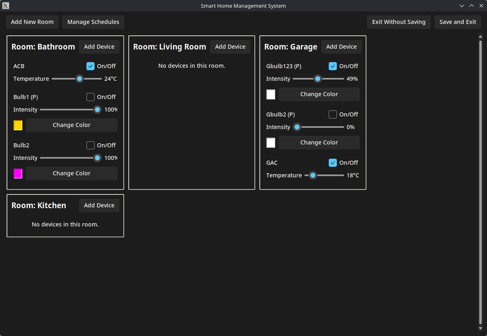
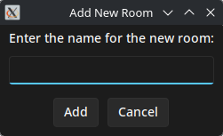
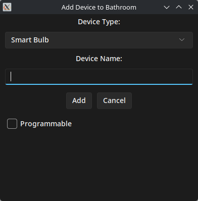
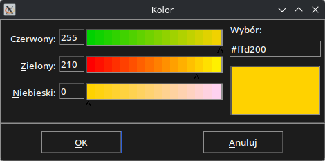
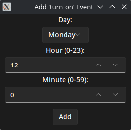

# Smart Home Management System (Practice 6)

This version introduces a complete Graphical User Interface (GUI) built with Tkinter, replacing the previous command-line interface. The GUI provides a modern, user-friendly way to manage the entire smart home system, following a Model-View-Controller (MVC) architecture.

- **Student:** Błażej Drozd
- **GitHub Repository:** [https://github.com/Tsugumik/programacion-uja](https://github.com/Tsugumik/programacion-uja)

## Features & Screenshots

The GUI replicates all the functionalities of the previous CLI version, including:
- Managing rooms and devices.
- Adding new rooms and devices (Smart Bulbs, Air Conditioners).
- Controlling device states (on/off, intensity, temperature, color).
- Scheduling events for programmable devices.
- A modern, dark-themed interface.

### Main View


### Adding a New Room


### Adding a New Device


### Changing Bulb Color


*Note: I apologize that the color picker dialog in the screenshot is in Polish. It is a standard system dialog provided by Tkinter, which automatically adopts the language of the operating system (in my case, Polish).*

### Managing Schedules


### Adding a Scheduled Event


## Installation and Usage

To run the application, you first need to install the required libraries.

1.  Clone the repository:
    ```bash
    git clone https://github.com/Tsugumik/programacion-uja.git
    cd programacion-uja
    ```

2.  Install dependencies:
    The project uses a modern theme for Tkinter, which needs to be installed. Run the following command to install it from requirements.txt:
    ```bash
    pip install -r requirements.txt
    ```

3.  Run the application:
    ```bash
    python main.py
    ```

---

# Smart Home Management System (Practice 5)

This is a command-line app for managing a smart home system. You can manage rooms, devices (like Smart Bulbs and Air Conditioners), and schedules. This version is a refactor of the previous project, with a focus on better Object-Oriented Programming (OOP) principles.

- **Student:** Błażej Drozd
- **GitHub Repository:** [https://github.com/Tsugumik/programacion-uja](https://github.com/Tsugumik/programacion-uja)

## Unit Tests

I decided to include unit tests instead of screenshots. I believe this is a better way to demonstrate that the application works correctly.
To run the tests, use the following command in the main project directory:

```bash
python -m unittest test_main.py
```
